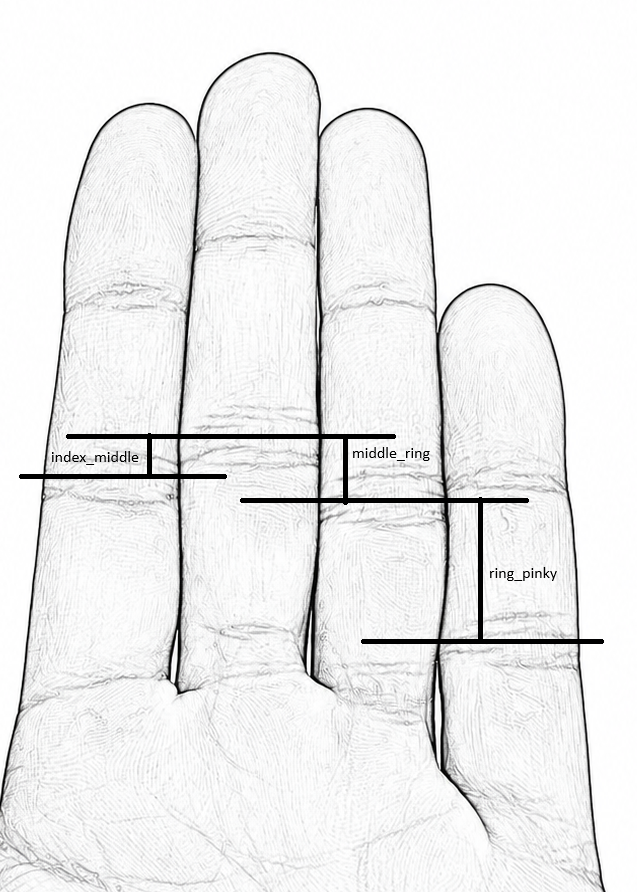
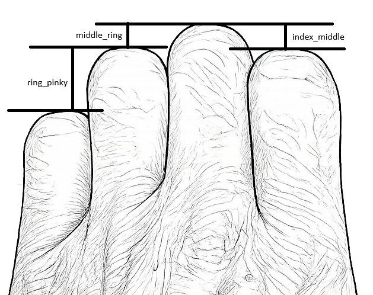

# Parametric Fingerboard

Desktop GUI application for designing a parametric fingerboard and exporting 3D models for fabrication.

## GUI Preview

<p align="center">
	
</p>

## Measuring Finger Height Differences

<div style="display:flex; gap:16px; align-items:flex-start; flex-wrap:wrap;">
	<figure style="flex:1 1 320px; margin:0; text-align:center;">
		
		<figcaption>Palm-side measurement</figcaption>
	</figure>
	<figure style="flex:1 1 320px; margin:0; text-align:center;">
		
		<figcaption>Back-of-hand measurement</figcaption>
	</figure>
</div>

There are two ways to measure the difference in height: from the palm side or from the back of the hand side. At the moment it is not yet clear which method is best, so either measurement style is acceptable.

Measure the height difference as a positive value only, then enter that positive number in the GUI. The app treats these values as absolute differences.

## Features
- Interactive PyQt6 GUI with live 3D preview
- Parametric geometry with independent left/right finger-depth deltas
- Global + advanced controls (margins, chamfers, center bulk, cord hole, edge depth)
- Safety clamping with user-visible warnings for invalid geometry combinations
- Export support for multiple CAD/mesh formats

## Supported Export Formats
- STL (`.stl`)
- 3MF (`.3mf`)
- STEP (`.step`, `.stp`)
- AMF (`.amf`)
- SVG (`.svg`)
- TJS (`.tjs`, `.json`)
- DXF (`.dxf`)
- VRML (`.wrl`, `.vrml`)
- VTP (`.vtp`)
- BREP (`.brep`)
- BIN BREP (`.bin`)

## Requirements
- Python 3.10+

Python package dependencies are listed in `requirements.txt`.

Some non-pip system dependencies are still required for OpenGL rendering on Linux.

On Ubuntu 22.04, install them with:

```bash
sudo apt update
sudo apt install -y libgl1-mesa-dri libglx-mesa0 libglu1-mesa mesa-utils
```

If you want to verify the system OpenGL setup, run:

```bash
glxinfo | grep "OpenGL version"
```

## Development Setup

1. Clone and enter the repository:

```bash
git clone https://github.com/2103simon/parametric_fingerboard.git
cd parametric_fingerboard
```

2. Create and activate a virtual environment:

```bash
python3 -m venv .venv
source .venv/bin/activate
```

3. Install dependencies:

```bash
pip install -r requirements.txt
pip install -e .
```

This installs the full Python stack needed by the GUI and the CAD model code.

## Run the App

Using the console script entry point:

```bash
fingerboard-gui
```

Or directly as a module:

```bash
python -m parametric_fingerboard.app
```

## Parameter Notes

- The GUI provides live preview updates shortly after editing values.
- Some parameter combinations are automatically clamped to keep geometry manufacturable.
- If clamping occurs, the app shows warnings and may write corrected values back into fields.

## Build a Standalone Binary (Optional)

If you want a single-file executable for distribution:

```bash
pip install pyinstaller
pyinstaller --onefile --windowed src/parametric_fingerboard/app.py
```

The generated binary will be placed in `dist/`.

## Disclaimer

This software generates 3D models intended for 3D printing. Improper use, design, or manufacturing of these models may result in injury, equipment damage, or other harm. The author is not responsible for any injury, damage, or loss resulting from the use, misuse, or manufacturing of models created with this software. Use at your own risk. No permission is granted to use, copy, modify, or distribute this software without explicit written consent from the author.
