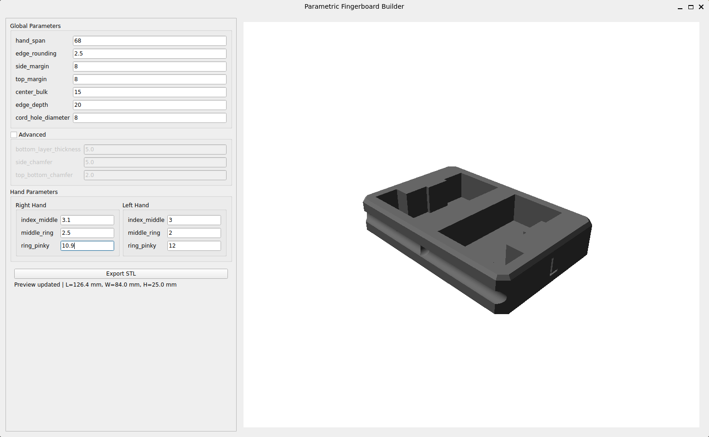

# Parametric Fingerboard

Desktop GUI application for designing a parametric fingerboard and exporting 3D models for fabrication.

## GUI Preview



## Features
- Interactive PyQt6 GUI with live 3D preview
- Parametric geometry with independent left/right finger-depth deltas
- Global + advanced controls (margins, chamfers, center bulk, cord hole, edge depth)
- Safety clamping with user-visible warnings for invalid geometry combinations
- Export support for multiple CAD/mesh formats

## Supported Export Formats
- STL (`.stl`)
- 3MF (`.3mf`)
- STEP (`.step`, `.stp`)
- AMF (`.amf`)
- SVG (`.svg`)
- TJS (`.tjs`, `.json`)
- DXF (`.dxf`)
- VRML (`.wrl`, `.vrml`)
- VTP (`.vtp`)
- BREP (`.brep`)
- BIN BREP (`.bin`)

## Requirements
- Python 3.10+

Core package dependencies are declared in `pyproject.toml`.

GUI/runtime dependencies are listed in `requirements.txt`.

## Development Setup

1. Clone and enter the repository:

```bash
git clone https://github.com/2103simon/parametric_fingerboard.git
cd parametric_fingerboard
```

2. Create and activate a virtual environment:

```bash
python3 -m venv .venv
source .venv/bin/activate
```

3. Install dependencies:

```bash
pip install -r requirements.txt
pip install -e .
```

## Run the App

Using the console script entry point:

```bash
fingerboard-gui
```

Or directly as a module:

```bash
python -m parametric_fingerboard.app
```

## Parameter Notes

- The GUI provides live preview updates shortly after editing values.
- Some parameter combinations are automatically clamped to keep geometry manufacturable.
- If clamping occurs, the app shows warnings and may write corrected values back into fields.

## Build a Standalone Binary (Optional)

If you want a single-file executable for distribution:

```bash
pip install pyinstaller
pyinstaller --onefile --windowed src/parametric_fingerboard/app.py
```

The generated binary will be placed in `dist/`.

## Disclaimer

This software generates 3D models intended for 3D printing. Improper use, design, or manufacturing of these models may result in injury, equipment damage, or other harm. The author is not responsible for any injury, damage, or loss resulting from the use, misuse, or manufacturing of models created with this software. Use at your own risk. No permission is granted to use, copy, modify, or distribute this software without explicit written consent from the author.
